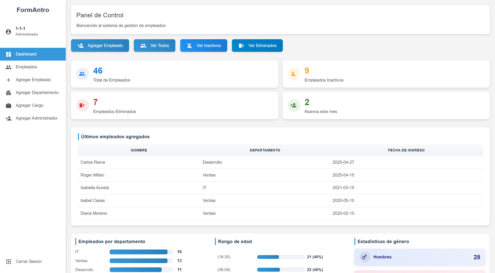
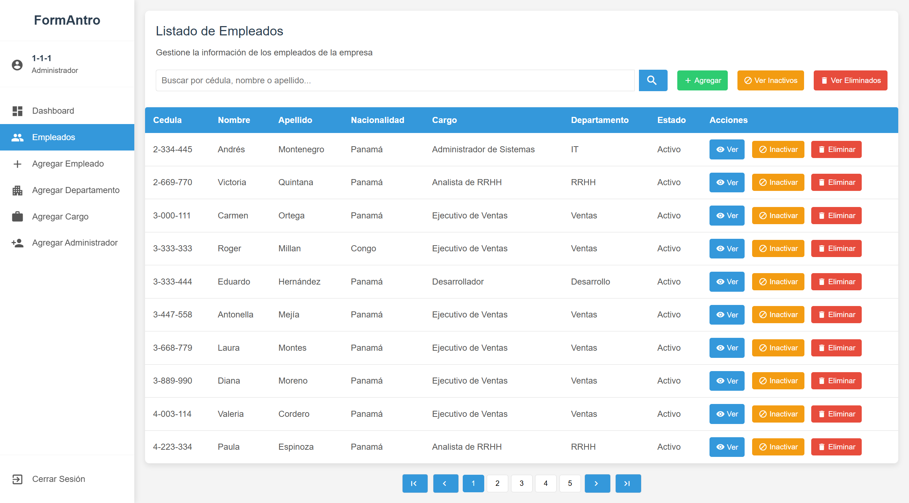
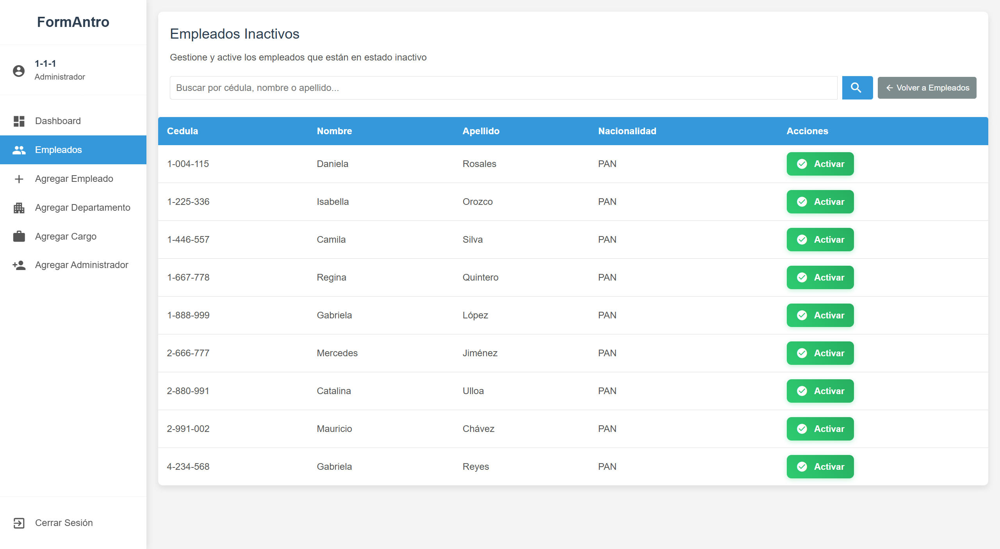
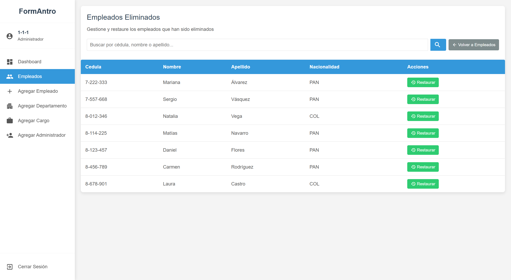

# Proyecto FormAntro - Sistema de Gestión de Empleados

## Descripción General

FormAntro es un sistema de gestión de empleados desarrollado para una pequeña empresa. El sistema proporciona funcionalidades CRUD (Crear, Leer, Actualizar y Eliminar) para la administración de empleados, incluyendo un sistema de autenticación de usuarios con diferentes niveles de acceso.

## Funcionalidades Principales

- **Autenticación de Usuarios**: Sistema de login seguro con diferentes roles (Administrador y Empleado)
- **Gestión de Empleados**:
  - Ver lista de empleados
  - Agregar nuevos empleados
  - Actualizar datos de empleados existentes
  - Eliminar empleados del sistema

## Estructura del Proyecto

```
DS6/
├── config/           # Configuraciones de la aplicación y conexión a la BD
├── modules/          # Módulos funcionales del sistema
│   ├── auth/         # Módulo de autenticación
│   ├── employees/    # Módulo de gestión de empleados
│   ├── admin/        # Funcionalidades exclusivas para administradores
├── assets/           # Recursos estáticos (CSS, JS, imágenes)
├── lib/              # Bibliotecas de utilidades
├── index.php         # Punto de entrada principal
├── main.php          # Controlador principal
└── bd.sql            # Estructura de la base de datos
```

## Roles y Permisos

El sistema cuenta con dos tipos de usuarios:

### Administrador

- Acceso completo al sistema
- Puede gestionar todos los empleados (crear, ver, editar, eliminar)
- Administra usuarios y permisos

### Empleado

- Acceso restringido
- Solo puede ver y editar su propia información

## Guía de Uso

### Autenticación

1. Acceda a la página de inicio
2. Ingrese sus credenciales (usuario y contraseña)
3. El sistema lo redirigirá al panel correspondiente según su rol

### Gestión de Empleados

1. Navegar a la sección "Empleados"
2. Utilizar las opciones disponibles para administrar registros:
   - **Ver**: Listar todos los empleados o buscar por diferentes criterios
   - **Agregar**: Completar el formulario con los datos del nuevo empleado
   - **Editar**: Seleccionar un empleado y modificar sus datos
   - **Eliminar**: Seleccionar un empleado y confirmar su eliminación

---

## Capturas de Pantalla

A continuación se muestran algunas capturas de pantalla del sistema:

### Dashboard Principal del Administrador



### Listado de Empleados



### Empleados Inactivos



### Empleados Eliminados



---
